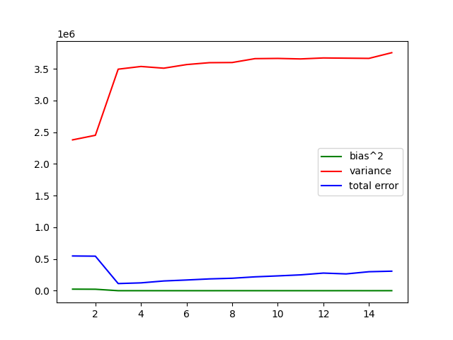
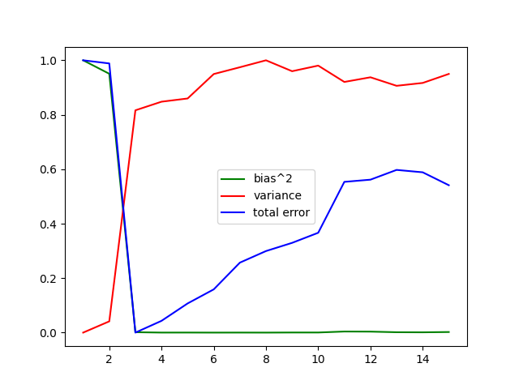

# Task 1
The `LinearRegression().fit()` takes two arguments, which are both columns of a data frame, and returns an object which contains the parameters of the variable being trained. In this case, we assign it to `Lreg` and then access `Lreg.intercept_` and `Lreg.coef_`.

# Task 2
The `biasvar.csv` file contains the values of bias, variance and irreducible error for each degree and each trainset (240 rows). The `averages.csv` file contains the average bias, variance, irreducible error, and MSE over all the trainsets for each degree (15 rows).  

It is difficult to analyse the values in `biasvar.csv` as there are 16 rows for each class of functions. It is more convenient to consider the values in `averages.csv`, as they show representative values for each class.  
Looking at these values, we can see that the trend is roughly as predicted (considering that complexity is directly correlated to degree). The values of bias start at approximately 140 and quickly drop, flattening after 9$^\text{th}$ degree polynoimials at about $-20$. The model graph also shows similar behaviour – a quick initial drop, followed by stabilisation.  
Similarly, variance starts low (approximately $2.5 \cdot 10^6$) and tops out at about $3.7 \cdot 10^6$ from 6$^\text{th}$ degree polynomials onwards. However, the rate of change does not match in this case. It presents a rapid rise, followed by a flatter section of the graph; in the ideal graph, we observe a consistently low value followed by a sudden upwards trend at higher complexities.  
The MSE values also show a roughly correlated pattern with the model graph. They start relatively high, at $5 \cdot 10^5$, fall to a minimum of $9.3 \cdot 10^4$, and rise again to about $3.5 \cdot 10^5$.  

The pattern of MSE values helps us to see why the trend of variance might not be as expected. The minimum MSE occurs at polynomials of degree 3, which means that variance must be rising across this point (as in the ideal scenario). This could be why the variance shows a sudden rise from 2$^\text{nd}$ degree polynomials onwards.

# Task 3
The values of irreducible error are tabulated in the `biasvar.csv` and `averages.csv` files. As before, we will consider only the latter for convenience.  

We note first that the irreducible error shows a trend almost identical to that of variance, but in the opposite direction. It starts from a higher value of $-2 \cdot 10^6$, dropping quickly to $-3.5 \cdot 10^6$. This is probably because variance is extremely high and dominates over the other terms in the expression for irreducible error.  

In general, we see that more complex models tend to have lower irreducible errors. This makes sense, as more complex models will be able to fit the data better.

# Task 4
When we graph the values, we note that the high discrepancy among the ranges ($10^2$ to $10^6$) causes the graph to be unclear and uninterpretable. This graph can be seen in Figure 1.  

Thus, we rescale the values to lie between 0 and 1, using the formula
$$x_\text{rescaled} = \frac{x-x_\text{min}}{x_\text{max} - x_\text{min}},$$
and consider this graph instead. It can be seen in Figure 2.  

The graph correlates with what we expect from our observations in Task 2 above. The MSE attains a minimum at 3$^\text{rd}$ degree polynomials, which is visible; furthermore, the bias drops across this point and the variance rises. After this point, both the bias and the variance quickly attain their extrema and do not change a lot.  

Thus, the nature of the data is such that it is best captured by a cubic polynomial. In other words, it does not have a very high variance (as higher-degree polynomials tend to have higher variance values).
