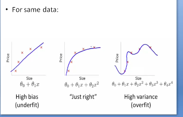

## AlphaGo
AlphaGo was the first computer Go program to defeat a 9-dan professional player. It made use of the Monte Carlo tree search algorithm, augmented by knowledge of a large number of human games.  

## Generalisation and Goodness of Fit
Generalisation refers to how well the concepts learnt by an ML model generalises to instances of data not yet seen by the model. Humans find this easy, but computers struggle.  

Goodness of fit describes how will a model fits a set of observations.  
Overfitting means that the model answers the training data well, but based on the wrong patterns – as if it had memorised the answers to it. It is caused by extracting too much information from the training set.  
The low error rate in the training data is called *low bias* (bias refers to error due to incorrect assumptions), while the poor generalisation capability, shown in poor performance on the test data, is called *high variance*.  
Overfitting tends to occur when we provide too few examples, or build an excessively complex model to fit the sample.  
Underfitting means that the model has not been exposed enough to the training data to respond to it correctly. This occurs when we do not have enough data to train or we try to fit the wrong model to the data.  
This is exhibited in *high bias* and *low variance* – it is consistent, but consistently wrong.  
A possible fix for underfitting is to increase the number of features, since it expands the hypothesis space.

