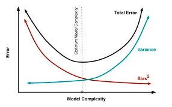

# Machine Learning (Contd.)
## Bias-Variance Tradeoff
A simple model with fewer parameters is more likely to have high bias and low variance, while one with more parameters tends to have high variance and low bias. The challenge lies in finding the right balance without overfitting or underfitting the data.  

As more parameters are added to a model, its complexity rises, and variance becomes the main concern while bias becomes less important.

Concretely, suppose that a training set consists of points $\{(x_1, y_1), \dots, (x_n, y_n)\}$. Suppose that there is a function $y = f(x) + \varepsilon$, where $\varepsilon$ is Gaussian noise, which has mean 0 and variance $\sigma^2$. We wish to find $\hat{f}(x)$, to approximate $f$ as well as possible.  
To measure how well the approximation was performed, we define the least square error metric, defined by
$$\sum_i (y - \hat{f}(x))^2,$$
which is what we are going to try to minimise.  

In fact, the mean squared error can be decomposed as
$$E\left[\left(y-\hat{f}(x)\right)^2\right] = \text{Bias}\left(\hat{f}(x)\right)^2 + \text{Var}\left(\hat{f}(x)\right) + \sigma^2,$$
where
$$\begin{split}
\text{Bias}\left(\hat{f}(x)\right) &= E\left[\hat{f}(x) - f(x)\right] \\
&= E\left[\hat{f}(x)\right] - f(x), \end{split}$$
since $f$ is deterministic; and
$$\text{Var}\left(\hat{f}(x)\right) = E\left[\hat{f}(x)^2\right] - E\left[\hat{f}(x)\right]^2.$$

To prove this, note that, since $y = f(x) + \varepsilon,$
$$\begin{split}
E[y] &= E[f] + E[\varepsilon] = f \\
\text{Var}[y] &= E\left[\left(y-E[y]\right)^2\right] = E\left[\varepsilon^2\right] = \text{Var}[\varepsilon] + \left(E[\varepsilon]\right)^2 = \sigma^2. \end{split}$$

Then, the error on an unseen sample can be decomposed as
$$\begin{split}
E\left[(y-\hat{f})^2\right] &= E\left[(f + \varepsilon - \hat{f})^2\right] \\
&= E\left[\left(f + \varepsilon - \hat{f} + E[\hat{f}] - E[\hat{f}]\right)^2\right] \\
&= \left(f-E[\hat{f}]\right)^2 + E\left[\varepsilon^2\right] + E\left[\left(E[\hat{f}] - \hat{f}\right)^2\right] \\
&+ 2\left(f- E[\hat{f}]\right)E[\varepsilon] + 2E[\varepsilon]\left(E[\hat{f}] - \hat{f}\right) + 2E\left[E[\hat{f}] - \hat{f}\right]\left(f - E[\hat{f}]\right) \\
&= \left(f-E[\hat{f}]\right)^2 + E\left[\varepsilon^2\right] + E\left[\left(E[\hat{f}] - \hat{f}\right)^2\right] + 0 + 0 + 0 \\
&= \left(f-E[\hat{f}]\right)^2 + \text{Var}[y] + \text{Var}[\hat{f}] \\
&= \text{Bias}\left(\hat{f}(x)\right)^2 + \text{Var}\left(\hat{f}(x)\right) + \sigma^2, \end{split}$$
as we have seen.

## Avoiding Overfitting
There are a number of techniques to avoid overfitting, like cross-validation, regularisation, feature selection and dimensionality reduction.

### Cross-Validation
In conventional validation, the dataset is partitioned into the training, validation and test sets. The validation set is used to experiment and tune the parameters of the learnt model, or to compare multiple prediction algorithms (trained using the dataset).  
If the training data is sufficient after partition, then validation will work. However, otherwise, cross-validation is preferable. It allows us to utilise the available data more efficiently.
