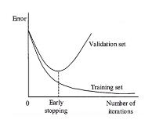

# Machine Learning
## Avoiding Overfitting
### Cross-Validation (contd.)
Cross-validation is a model evaluation method that checks how well a model generalises to new data.  
In one round of cross-validation, data is partitioned into training and testing subsets; multiple such rounds are performed under different partitions. The testing results of all rounds are averaged to estimate the performance of the model.  

There are two popular cross-validation schemes – non-exhaustive and exhaustive.  
Under the non-exhaustive category, $k$-fold cross-validation is popular – the dataset is split into $k$ equal partitions ("folds"), and in each trial, one fold becomes the testing set and the rest become the training set. Another way is called the holdout method, in which the data is split into training and testing data numerous times. However, some samples may never be tested and some may be selected multiple times.  
Under the exhaustive category, one method is leave-out-one cross-validation (LOOCV), which is $k$-fold cross-validation with $k$ set to the number of data points. Thus a single data point is left out of the training set in each round. Another method, nested cross-validation, is popularly used to tune the parameters of an algorithm; a set is divided into $k$ folds, one of which is set aside as the testing set, and $(k-1)$-fold cross-validation is performed $k$ times. Each time, we pick the value of parameter $X$ that works best; finally, we pick the value that was returned the most number of times in the inner loop.

### Regularisation
Regularisation adds extra parameters to the error function to penalise complex models, since complexity is a source of overfitting.  

Another form of regularisation is called early stopping, in which the training procedure is halted early as it is likelier to produce a simpler model.

To decide when to stop, we interleave training and testing, and stop training when the testing error begins to increase.  
Regularisation needs to be kept at a moderate level – if it is too small, it makes no impact, and if it is too big, it results in underfitting.  

Concretely, suppose $\hat{f}(x) = \theta_0 + \theta_1 x + \theta_2 x^2 + \theta_3 x^3$. We want to minimise the MSE
$$J(\theta) = \frac1m \sum_{i=1}^m(\hat{f}_\theta (x^{(i)}) - y^{(i)})^2,$$
where $m$ is the number of training samples.  
Suppose we want to penalise the higher order terms ($x^2$ and $x^3$). Then we edit $J(\theta)$ to include, say, $1000\theta_3 + 1000\theta_4$. Thus the values of $\theta_3$ and $\theta_4$ will tend to be small to minimise the error.  
Note, however, that a significantly high penalty can convert an overfit problem to an underfit problem.

### Feature Selection
Feature selection is the process of picking a subset of significant features to use in constructing a better model, since some features simply add randomness without being useful. It simply consists of deciding whether to include a feature or not.  
We either start with all features and remove features iteratively, or start with a minimum set of features and add features iteratively.
