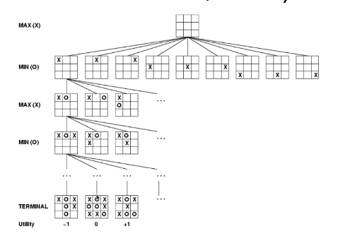
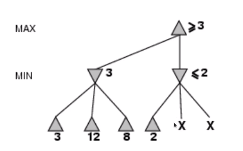
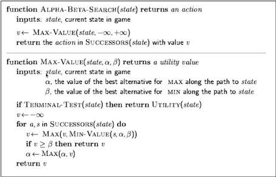

# Game Strategies
Games are distinct from search problems as they are not always deterministic, and we need to account for any possible response by the opponent.  

A general type of game is a 2-player game like tic-tac-toe, for which we can create a game tree that has to be followed. Each level of nodes alternately maximises and minimises benefit.



## Minimax
This idea is formalised by the minimax algorithm. We start from the values of the terminal nodes and alternately take the minimum and maximum up to the highest level.  

```hs
minimaxDecision :: State -> Action
minimaxDecision st = argmax (succ st) maxVal

maxVal :: State -> Value
maxVal st = if (terminal st)
            then (utility st)
            else foldl (\a b -> max a (minVal b))
                       (succ s)
                       (-∞)

minVal :: State -> Value
minVal st = if (terminal st)
            then (utility st)
            else foldl (\a b -> min a (maxVal b))
                       (succ s)
                       (∞)
```

The minimax algorithm is complete and optimal. It has time complexity $O(b^m)$ and the space complexity is $O(bm)$. However, these do not make it feasible to obtain exact solutions.  

$\alpha$-$\beta$ pruning is one method to improve the time. We can eliminate whole branches by considering the possibilities given previously found values.  



With perfect ordering, pruning improves the time complexity to $O(b^{\frac{m}{2}})$.



The standard approach to limiting the number of nodes we search is to use a cutoff test (like a depth limit) or an evaluation function (which estimates the desirability of the position).  
Evaluation functions are typically linear weighted sums of features.  

Using minimax with cutoff is identical to the above description, except that the `terminal` test is replaced by a `cutoff` test, and the `utility` test is replaced by `eval`.
