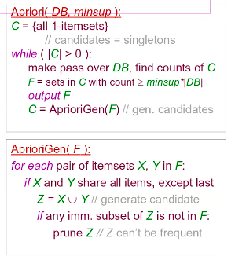

# Overview of Data Analytics
The field of data analytics originated from the database community.  

*Data mining* is the automated extraction of interesting patterns from large databases. A pattern may be an association, a clustering, or a classification.

## Association Rules
Association rules have two main metrics: *support* and *confidence*. If we have an association rule $X \to Y$, we define
$$\text{support} = \frac{\text{transactions satisfying } X \to Y}{|D|}$$
and
$$\text{confidence} = \frac{\text{support}(X \to Y)}{\text{support}(X)}.$$

An algorithm that helps to find these rules is the *a priori* algorithm. It relies on the idea that an itemset can be frequent only if all its subsets are frequent.  
It starts by creating a set of singleton itemsets and finding their counts. It filters the set of itemsets by checking for counts greater than the minimum support and combines the resultant elements, iteratively.

There are different types of association rules – boolean, hierarchical, or categorical rules are some of these. They may also be cyclic, constrained or sequential.